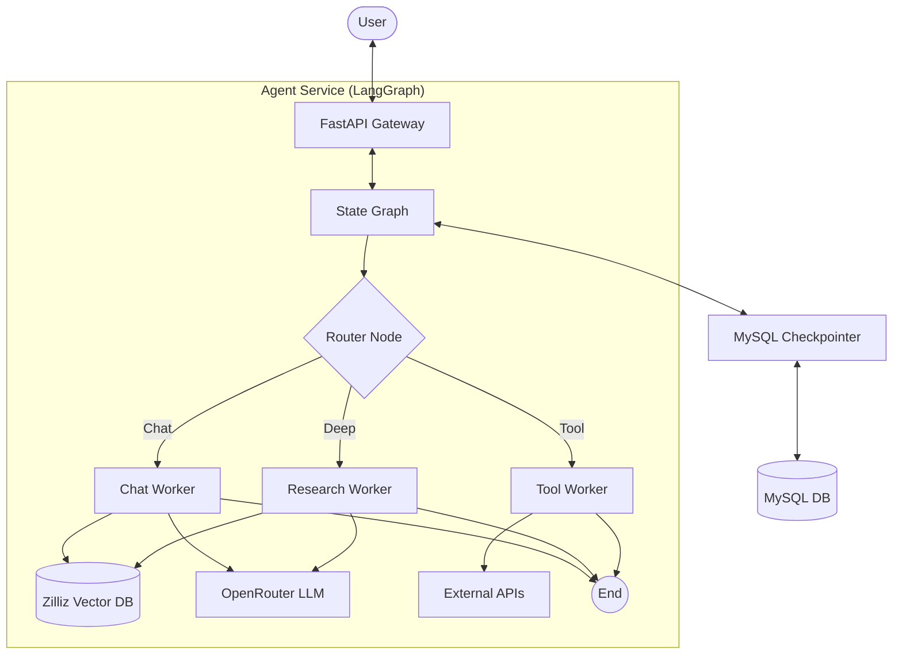

# Technical Design Document: Financial Agent Service

## 1. Architecture Overview

This service implements a conversational agent based on **LangGraph**, utilizing a "Router-Supervisor" architecture to handle different types of user intents: Chit-Chat, Deep Research, and Tool usage.

### Mermaid Architecture



## 2. Data Flow

1.  **Request**: User sends a message via `/chat/stream` with `session_id`.
2.  **State Load**: System loads previous conversation state from MySQL using `session_id`.
3.  **Routing**: `Router` node analyzes the latest message to determine intent:
    *   `chat`: Simple conversation, investing queries -> `ChatWorker`.
    *   `deep`: Complex analysis, report generation -> `ResearchWorker`.
    *   `tools`: Stock price, album info -> `ToolWorker`.
4.  **Execution**:
    *   **ChatWorker**: Retrieves relevant knowledge & style from Zilliz -> Generates response with "Huafei" persona.
    *   **ResearchWorker**: (Future) Multi-step planning and deep retrieval.
    *   **ToolWorker**: Executes specific function calls.
5.  **Response**: Stream generated tokens back to the user.
6.  **Persistence**: Save the new state (messages) to MySQL.

## 3. Database Schema (MySQL)

We use a custom `Checkpointer` implementation to store LangGraph checkpoints in MySQL.

### Table: `checkpoints`
Stores the serialized state of the graph at each step.

| Column | Type | Description |
| :--- | :--- | :--- |
| `thread_id` | `VARCHAR(255)` | Primary Key part 1. Session ID. |
| `checkpoint_id` | `VARCHAR(255)` | Primary Key part 2. Step ID. |
| `parent_checkpoint_id`| `VARCHAR(255)` | ID of the previous checkpoint. |
| `type` | `VARCHAR(50)` | Type of checkpoint. |
| `checkpoint` | `LONGBLOB` | Serialized checkpoint data (msgpack/pickle). |
| `metadata` | `LONGBLOB` | Serialized metadata. |
| `created_at` | `TIMESTAMP` | Auto-generated timestamp. |

### Table: `checkpoint_writes`
Stores pending writes for the graph execution.

| Column | Type | Description |
| :--- | :--- | :--- |
| `thread_id` | `VARCHAR(255)` | Primary Key part 1. |
| `checkpoint_id` | `VARCHAR(255)` | Primary Key part 2. |
| `task_id` | `VARCHAR(255)` | Primary Key part 3. |
| `idx` | `INT` | Primary Key part 4. |
| `channel` | `VARCHAR(255)` | The channel name. |
| `type` | `VARCHAR(50)` | Type of write. |
| `value` | `LONGBLOB` | Serialized value. |

## 4. API Interface

### POST `/chat/stream`
Stream the agent's response.

**Request:**
```json
{
  "message": "User input text",
  "session_id": "unique-session-id",
  "stream": true
}
```

**Response (SSE):**
```text
data: {"event": "token", "data": "Hello"}
data: {"event": "token", "data": " world"}
...
data: {"event": "end", "data": ""}
```

### GET `/chat/history/{session_id}`
Retrieve past messages.

**Response:**
```json
{
  "messages": [
    {"role": "user", "content": "..."},
    {"role": "assistant", "content": "..."}
  ]
}
```
