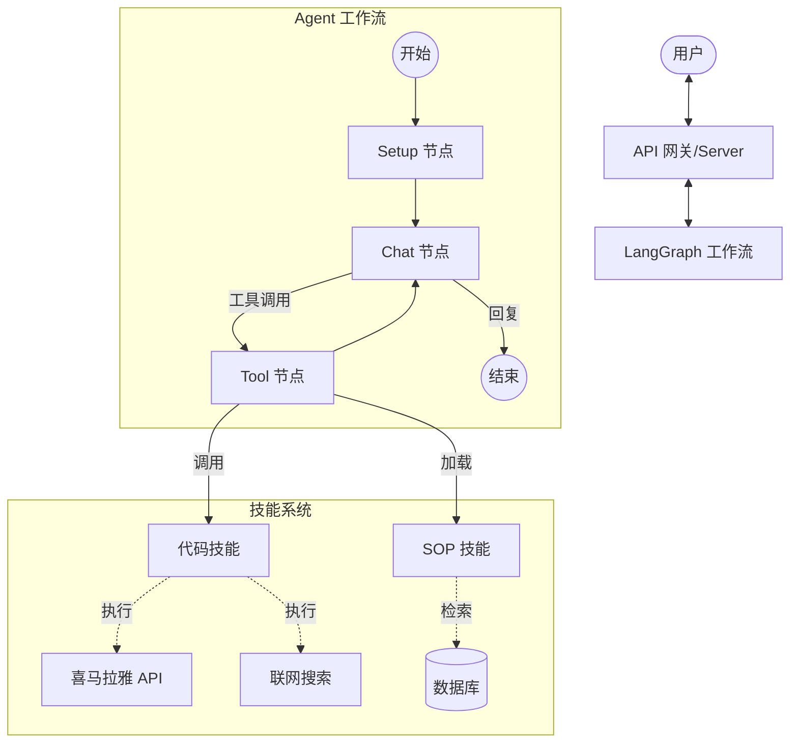

# 技术方案：Agent 服务框架

## 1. 概述

本项目基于 **LangGraph** 实现了一个对话式 AI Agent 服务，底层模型采用 **火山引擎 (Volcengine/Doubao)**。

系统架构遵循 **有状态图 (Stateful Graph)** 模式，Agent 能够在多轮对话中维护历史记录、用户上下文和配置信息。系统采用双轨技能机制，既支持硬编码的 Python 工具，也支持基于内容的动态 SOP（标准作业程序）加载。

### 架构图



## 2. 核心组件

### 2.1 图拓扑结构 (`graph.py`)

工作流定义为 `StateGraph`，包含以下节点：

1.  **`setup` (初始化)**:
    -   **职责**: 初始化 Agent 状态。
    -   **逻辑**: 如果状态中缺失配置，则从数据库加载 Agent 配置（如 Prompt 模板、模型参数）。
2.  **`chat` (对话核心)**:
    -   **职责**: 推理与决策引擎。
    -   **逻辑**:
        -   构建系统 Prompt（基础 Prompt + 核心记忆 + 技能指令）。
        -   调用火山引擎 LLM（绑定了可用工具）。
        -   生成工具调用请求或最终回复。
3.  **`tools` (工具执行)**:
    -   **职责**: 执行被请求的工具。
    -   **逻辑**: 使用 LangGraph 预置的 `ToolNode` 执行注册的 Python 函数。

### 2.2 状态定义 (`state.py`)

`AgentState` 追踪对话的全生命周期数据：

```python
class AgentState(TypedDict):
    messages: List[BaseMessage]  # 对话历史
    next_step: str               # (内部) 流程控制
    user_id: str                 # 用户 ID
    agent_id: str                # Agent 人设 ID
    
    # 上下文与数据
    intent: Dict[str, Any]       # 用户意图分析结果
    rag_data: Dict[str, Any]     # 检索到的知识
    skill_results: Dict[str, Any]# 技能执行结果
    
    # 元数据
    user_info: Dict[str, Any]    # 用户画像/偏好
    agent_config: Dict[str, Any] # 动态配置 (Prompts, Model 等)
```

## 3. 技能与工具系统

框架采用混合能力模式：

### 3.1 代码型技能 (`skills/*.py` & `tools/*.py`)
针对需要复杂计算或外部 API 调用的任务，使用 Python 实现。

*   **工程结构**:
    *   `skills/`: 纯 Python 业务逻辑层（解耦 LangChain）。
    *   `tools/`: LangChain `@tool` 适配层，将技能暴露给 LLM。
*   **现有技能**:
    *   **喜马拉雅 (Ximalaya)**: 调用 API 获取特定主播的专辑/声音数据。
    *   **联网搜索 (Web Search)**: 执行实时互联网搜索。
    *   **知识库检索 (RAG)**: 从向量数据库检索领域知识。

### 3.2 动态 SOP 技能 (`tools/skills.py`)
允许 Agent 在不部署代码的情况下“学习”新流程。

*   **机制**: `load_skill` 工具允许 LLM 根据名称查询数据库中的“技能”或“SOP”。
*   **内容**: 返回文本指令集（Markdown/Prompt），注入到当前上下文中。
*   **场景**: 复杂的跨步骤任务，如“深度研报撰写”、“特定领域分析流程”。

## 4. 集成细节

*   **LLM 供应商**: 火山引擎 (Doubao)，通过 `ChatVolcengine` 封装。
    *   支持流式输出 (Streaming)。
    *   支持动态模型路由（根据配置覆盖默认模型）。
*   **持久化**:
    *   **Checkpointer**: 基于 MySQL 的状态检查点保存（用于多轮对话记忆）。
    *   **数据库**: 存储 Skills (SOPs)、Agent 配置以及对话历史归档。

## 5. 数据流转

1.  **初始化**: 请求进入 `setup` 节点；加载 Agent 配置。
2.  **推理**: `chat` 节点准备上下文（系统 Prompt + 记忆）并请求 LLM。
3.  **工具决策**: LLM 判断是否需要工具（如 `search_ximalaya`, `load_skill`）。
4.  **执行**: `tools` 节点执行 Python 函数。
    *   如果调用 `load_skill`，新指令从 DB 读取并返回。
5.  **循环**: 执行结果回传给 `chat`，生成最终回复。

---

## 6. 高并发与扩展性设计 (升级路线)

针对未来上线后可能面临的高并发场景（如 10k+ QPS），建议从以下维度进行升级：

### 6.1 应用层：无状态水平扩展
当前架构基于 LangGraph，本身应用服务应该是**无状态**的（状态存储在 DB），这天然支持水平扩展。

*   **容器化部署 (Kubernetes)**: 将 Agent Service 封装为 Docker 镜像，部署在 K8s 集群中。利用 HPA (Horizontal Pod Autoscaler) 根据 CPU/内存使用率自动扩缩容 Pod 数量。
*   **异步化处理**:
    *   对于耗时较长的任务（如“深度研究”），不要在 HTTP 请求中同步等待。
    *   **方案**: 引入消息队列 (RabbitMQ/Kafka) 和异步任务 Worker (Celery/Arq)。前端通过 WebSocket 接收进度更新，而不是保持长 HTTP 连接。

### 6.2 数据层：存储性能优化
LangGraph 依赖 `Checkpointer` 在每一步保存状态，这在长对话中会导致频繁的 DB 写操作。

*   **引入 Redis 作为热存储**:
    *   **方案**: 将 LangGraph 的 `Checkpointer` 默认后端从 MySQL 迁移到 **Redis**。Redis 的读写性能远高于 MySQL，适合存储活跃会话的短期状态。
    *   **持久化策略**: 采用“Redis (热) + MySQL (冷/归档)”策略。对话结束后或定期异步将 Redis 中的完整对话记录归档至 MySQL/Data Warehouse 用于分析。
*   **读写分离**: 如果必须使用关系型数据库，配置主从复制，写主读从。
*   **分库分表**: 根据 `session_id` (thread_id) 进行哈希分片，将流量分散到不同的数据库实例。

### 6.3 依赖层：LLM 稳定性与限流
外部 LLM API 是核心依赖，也是最大的不稳定性来源。

*   **多 Key 轮询与配额管理**: 维护一个 API Key 池，轮询使用以避免单 Key 速率限制。
*   **供应商灾备 (Fallback)**: 配置备用模型供应商（如 DeepSeek, OpenAI）。当主供应商 (Doubao) 响应超时或报错时，自动切换到备用模型。
*   **熔断与降级**: 当错误率超过阈值时，暂时阻断非核心功能的请求，保证核心聊天可用。

### 6.4 网络与接入层
*   **SSE/WebSocket 专用网关**:
    *   Python 服务处理长连接并发能力相对较弱（受限于 GIL，虽有 Asyncio）。
    *   **方案**: 使用 Go 或 Nginx Pushstream Module 作为前置网关，专门维护与客户端的长连接。后端 Python 服务只负责无状态的 Request/Response 处理，处理完后将消息推送到网关，由网关下发给用户。

### 6.5 监控与可观测性
*   **全链路追踪**: 接入 OpenTelemetry，追踪从 API -> Graph -> LLM -> Tool 的完整调用链，定位性能瓶颈。
*   **业务指标监控**: 监控 Token 消耗速率、平均响应时间 (Latency)、工具调用成功率。
